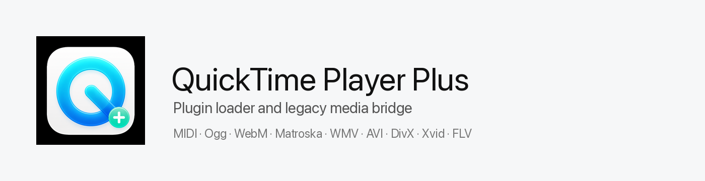
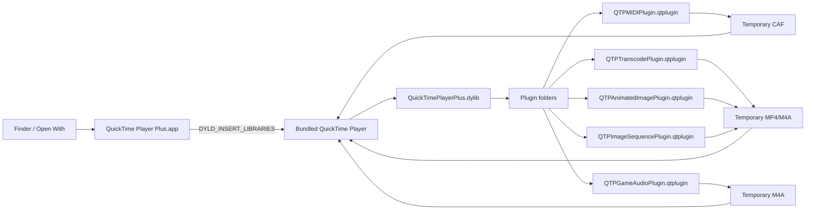

<picture>
  <source media="(prefers-color-scheme: dark)" srcset="docs/banner-dark.png">
  
</picture>

[](https://github.com/nisesimadao/QuickTimePlayerPlus/actions/workflows/ci.yml)
&nbsp;
&nbsp;
&nbsp;

[English README](README.md)

QuickTime Player Plus は、現在の QuickTime Player にプラグイン機構を追加する実験的なプロジェクトです。
起動時に小さな dylib を注入し、`*.qtplugin` bundle を読み込みます。
MIDI や QuickTime 7 時代の外部 component が扱っていた形式は、現在の QuickTime Player が読める一時メディアへ変換してから、QuickTime 標準の再生ウィンドウで開きます。

> **非公式プロジェクトと再配布上の制約**：このリポジトリには Apple の QuickTime Player 本体を含めません。
> Release の `.pkg` は、インストール先の `/System/Applications/QuickTime Player.app` を `/Applications/QuickTime Player Plus.app` へコピーし、自作のローダーとプラグインだけを追加します。
> Apple Inc. とは関係ありません。

## まず試す場合

```sh
git clone https://github.com/nisesimadao/QuickTimePlayerPlus.git
cd QuickTimePlayerPlus
make install-application
open -n -a "/Applications/QuickTime Player Plus.app" ~/Downloads/example.mid
```

`make install-application` は、`/System/Applications/QuickTime Player.app` を `/Applications/QuickTime Player Plus.app` の内部へコピーします。
その後、自作 launcher、plugin loader、プリインストールプラグインを組み込みます。

## 同梱コンポーネント

| 役割 | ファイル | 内容 |
| --- | --- | --- |
| パッチ / ローダー | `QuickTimePlayerPlus.dylib` | QuickTime 起動時に `*.qtplugin` を探索して読み込む |
| MIDI plugin | `QTPMIDIPlugin.qtplugin` | `.mid/.midi` を一時 `.caf` にレンダリングして QuickTime に渡す |
| Legacy media plugin | `QTPTranscodePlugin.qtplugin` | Ogg / WebM / Matroska / WMV / WMA / AVI / DivX / Xvid / FLV を ffmpeg で QuickTime 向けへ変換 |
| Animated image plugin | `QTPAnimatedImagePlugin.qtplugin` | GIF / WebP / AVIF / APNG を一時 MP4 に変換 |
| Game audio plugin | `QTPGameAudioPlugin.qtplugin` | VGM / NSF / SPC / PSF などを ffmpeg 対応 decoder で一時 M4A に変換 |
| Image sequence plugin | `QTPImageSequencePlugin.qtplugin` | `frame_0001.png` 形式の連番画像を一時 MP4 に変換 |
| 管理画面 | app menu | `QuickTime Player Plus Plugins...` で次回起動時の有効 / 無効を切り替える |

QuickTime 7 時代の Perian、Flip4Mac、XiphQT、DivX、Xvid と同じ codec component を復活させる構成ではありません。
QuickTime Player Plus では、各プラグインが必要な形式を一時ファイルへ変換するブリッジとして動作します。

## 仕組み



外側の `QuickTime Player Plus.app` は、Finder から書類を受け取る launcher です。
内部にコピーした Apple の QuickTime Player を、プラグインローダー付きで起動します。
ローダーは `*.qtplugin` bundle を読み込みます。
各プラグインは担当する形式だけを一時メディアへ変換し、最後は QuickTime 標準の再生ウィンドウへ処理を戻します。

## プラグインの配置場所

プリインストールプラグインは次の場所に入ります。

```text
QuickTime Player Plus.app/
└── Contents/PlugIns/QuickTimePlayerPlus/
    ├── QTPMIDIPlugin.qtplugin
    └── QTPTranscodePlugin.qtplugin
```

ユーザーが追加したプラグインは次の場所へ保存します。

```text
~/Library/Application Support/QuickTimePlayer+/PlugIns/
```

開発中だけ追加のプラグインディレクトリを使う場合は、`QTP_PLUGIN_PATH` を指定します。

```sh
QTP_PLUGIN_PATH="/path/to/PlugIns" open -n -a "/Applications/QuickTime Player Plus.app" file.mid
```

管理画面は、アプリメニューの **QuickTime Player Plus Plugins...** から開きます。

- チェックボックス：次回起動時の有効 / 無効を切り替えます。
- Add Plugin...：`.qtplugin` bundle をユーザープラグインフォルダへコピーします。
- Open Plugin Folder：ユーザープラグインフォルダを Finder で開きます。
- Clear Render Caches：MIDI と transcode の一時ファイルを削除します。
- Set ffmpeg...：Legacy media plugin が使う `ffmpeg` 実行ファイルを指定します。
- Set FluidSynth...：MIDI plugin が優先して使う `fluidsynth` 実行ファイルを指定します。
- Set SoundFont...：MIDI plugin が FluidSynth で使う `.sf2/.sf3/.dls` を指定します。

## MIDI レンダリング

MIDI plugin は、次の順序でレンダリングします。

1. `fluidsynth` と SoundFont / DLS が見つかる場合は、FluidSynth で `.wav` へレンダリングします。
2. 見つからない場合は、Apple の DLS Music Device で `.caf` へレンダリングします。

Apple DLS fallback でも velocity と program change は MIDI イベントとして処理します。
一般的な MIDI プレーヤーに近い音色が必要な場合は、FluidSynth と General MIDI / GS SoundFont を利用できます。
SoundFont は管理画面から指定します。

```sh
brew install fluid-synth
```

Game audio plugin も `ffmpeg` に依存します。
Homebrew の ffmpeg build に対象の game music decoder が含まれない場合は、拡張子を認識しても変換に失敗します。
その場合は、libgme / vgmstream 対応の ffmpeg、または専用 renderer plugin が必要です。

## ビルド

必要な環境は次の通りです。

- Apple Silicon Mac。
- Xcode Command Line Tools。
- `ffmpeg`。
  Legacy media plugin で使用し、Homebrew では通常 `/opt/homebrew/bin/ffmpeg` にあります。

```sh
make all
```

`/Applications` に通常起動できるアプリを作る場合は、次のコマンドを実行します。

```sh
make install-application
```

起動例は次の通りです。

```sh
open -n -a "/Applications/QuickTime Player Plus.app"
open -n -a "/Applications/QuickTime Player Plus.app" ~/Downloads/example.mid
```

## プラグイン形式

プラグインは bundle として作成します。
`Contents/Info.plist` に通常の bundle 情報と `QTPPluginSupportedExtensions` / `QTPPluginDescription` を設定し、実行ファイル側で `QTPPluginMain` を export します。

```objc
void QTPPluginMain(void)
{
    // Hook QuickTime behavior here.
}
```

ローダーは、次の場所を順に探索します。

- `QTP_PLUGIN_PATH`
- `QuickTime Player Plus.app/Contents/PlugIns/QuickTimePlayerPlus`
- `/Library/Application Support/QuickTimePlayerPlus/PlugIns`
- `~/Library/Application Support/QuickTimePlayer+/PlugIns`

詳しくは [docs/plugin-development.md](docs/plugin-development.md) を参照してください。

## Release

タグを push すると、GitHub Actions が次のファイルを作成して Release に添付します。

- `QuickTimePlayerPlus-<version>.pkg`
- `QuickTimePlayerPlus-<version>.dmg`
- `QuickTimePlayerPlus-<version>-plugins.zip`
- `SHA256SUMS.txt`

`.pkg` には Apple の app bundle を含めません。
インストール時にローカルの QuickTime Player をコピーし、`/Applications/QuickTime Player Plus.app` を作成します。

Installer の **Customize** 画面では、プリインストールするプラグインを選択できます。
既定ではすべて有効です。

```mermaid
flowchart TD
  PKG[QuickTimePlayerPlus.pkg] --> Core[Core launcher + loader]
  PKG --> MIDI[MIDI Plugin]
  PKG --> Legacy[Legacy Media Plugin]
  PKG --> Animated[Animated Image Plugin]
  PKG --> Game[Game Audio Plugin]
  PKG --> Sequence[Image Sequence Plugin]
  MIDI --> Store[/Library/Application Support/QuickTimePlayerPlus/PlugIns]
  Legacy --> Store
  Animated --> Store
  Game --> Store
  Sequence --> Store
  Core --> App[/Applications/QuickTime Player Plus.app]
```

```sh
git tag v0.1.0
git push origin v0.1.0
```

## 注意

- private API と dylib injection を使う実験的な実装です。
  macOS の更新によって動作しなくなる可能性があります。
- システム標準の `/System/Applications/QuickTime Player.app` は直接変更しません。
- 変換系プラグインは一時ファイルを作成します。
  専用キャッシュは次回起動時に削除します。
- 署名は ad-hoc です。
  配布物の起動時に Gatekeeper の警告が表示される場合があります。

## Credits

- [FluidSynth](https://www.fluidsynth.org/)：optional MIDI renderer used when installed locally.
- [FFmpeg](https://ffmpeg.org/)：media bridge used by legacy, animated image, image sequence, and game audio plugins.
- Apple QuickTime Player icon is used only as a local source icon on the user's Mac; this repository does not redistribute Apple app bundles.
