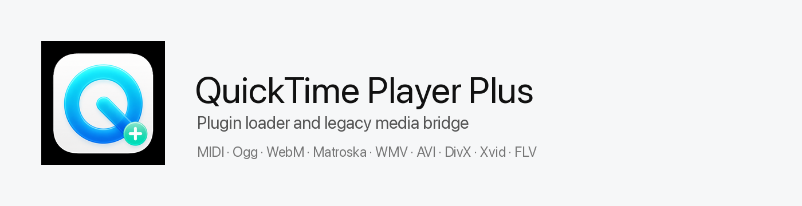
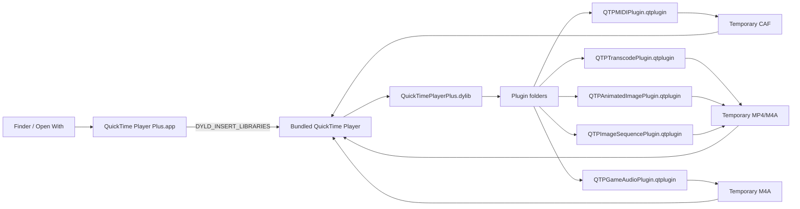

<picture>
  <source media="(prefers-color-scheme: dark)" srcset="docs/banner-dark.png">
  
</picture>

[](https://github.com/nisesimadao/QuickTimePlayerPlus/actions/workflows/ci.yml)
&nbsp;
&nbsp;
&nbsp;

QuickTime Player にプラグイン機構を足す実験です。起動時に小さな dylib を注入し、
`*.qtplugin` bundle を読み込みます。MIDI や QuickTime 7 時代の外部 component が担っていた
形式を、今の QuickTime が読める一時メディアへ変換して、**QuickTime 標準の再生ウィンドウ**で
開きます。

> **非公式・再配布制約** — このリポジトリは Apple の QuickTime Player 本体を含みません。
> Release の `.pkg` はインストール先 Mac にある `/System/Applications/QuickTime Player.app`
> をその場で `/Applications/QuickTime Player Plus.app` へコピーし、自作ローダーとプラグインだけを
> 追加します。Apple Inc. とは無関係です。

## まず試すなら

```sh
git clone https://github.com/nisesimadao/QuickTimePlayerPlus.git
cd QuickTimePlayerPlus
make install-application
open -n -a "/Applications/QuickTime Player Plus.app" ~/Downloads/example.mid
```

`make install-application` は `/System/Applications/QuickTime Player.app` を
`/Applications/QuickTime Player Plus.app` の内側へコピーし、自作 launcher / plugin loader /
プリインストールプラグインを組み込みます。

## 入っているもの

| 役割 | ファイル | 内容 |
| --- | --- | --- |
| パッチ / ローダー | `QuickTimePlayerPlus.dylib` | QuickTime 起動時に `*.qtplugin` を探して読み込む |
| MIDI plugin | `QTPMIDIPlugin.qtplugin` | `.mid/.midi` を一時 `.caf` にレンダリングして QuickTime に渡す |
| Legacy media plugin | `QTPTranscodePlugin.qtplugin` | Ogg / WebM / Matroska / WMV / WMA / AVI / DivX / Xvid / FLV を ffmpeg で QuickTime 向けへ変換 |
| Animated image plugin | `QTPAnimatedImagePlugin.qtplugin` | GIF / WebP / AVIF / APNG を一時 MP4 に変換 |
| Game audio plugin | `QTPGameAudioPlugin.qtplugin` | VGM / NSF / SPC / PSF などを ffmpeg 対応 decoder で一時 M4A に変換 |
| Image sequence plugin | `QTPImageSequencePlugin.qtplugin` | `frame_0001.png` 形式の連番画像を一時 MP4 に変換 |
| 管理画面 | app menu | `QuickTime Player Plus Plugins...` で次回起動時の有効/無効を切り替える |

QuickTime 7 時代によく使われた Perian / Flip4Mac / XiphQT / DivX / Xvid 系の役割を、
今の QuickTime の codec component として復活させるのではなく、プラグインごとの
変換ブリッジとして実装しています。

## 仕組み



外側の `QuickTime Player Plus.app` は Finder から書類を受け取る launcher です。
内側にコピーした Apple の QuickTime Player を、プラグインローダー付きで起動します。
ローダーは `*.qtplugin` bundle を読み、各プラグインが必要な形式だけを一時メディアへ変換して、
最後は QuickTime 標準の再生ウィンドウに戻します。

## プラグインの置き場所と追加

プリインストールプラグイン:

```text
QuickTime Player Plus.app/
└── Contents/PlugIns/QuickTimePlayerPlus/
    ├── QTPMIDIPlugin.qtplugin
    └── QTPTranscodePlugin.qtplugin
```

ユーザー追加プラグイン:

```text
~/Library/Application Support/QuickTimePlayer+/PlugIns/
```

開発中だけ追加する場合:

```sh
QTP_PLUGIN_PATH="/path/to/PlugIns" open -n -a "/Applications/QuickTime Player Plus.app" file.mid
```

管理画面はアプリメニューの **QuickTime Player Plus Plugins...** から開きます。

- チェックボックス: 次回起動時の有効/無効を切り替える
- Add Plugin...: `.qtplugin` bundle をユーザープラグインフォルダへコピーする
- Open Plugin Folder: ユーザープラグインフォルダを Finder で開く
- Clear Render Caches: MIDI / transcode の一時ファイルを削除する
- Set ffmpeg...: Legacy media plugin が使う `ffmpeg` 実行ファイルを指定する
- Set FluidSynth...: MIDI plugin が優先使用する `fluidsynth` 実行ファイルを指定する
- Set SoundFont...: MIDI plugin が FluidSynth で使う `.sf2/.sf3/.dls` を指定する

## MIDI レンダリング

MIDI plugin は次の順でレンダリングします。

1. `fluidsynth` と SoundFont / DLS が見つかる場合は FluidSynth で `.wav` へレンダリング
2. 見つからない場合は Apple の DLS Music Device で `.caf` へレンダリング

Apple DLS fallback でも velocity / program change は MIDI イベントとして処理されますが、
FluidSynth + General MIDI / GS SoundFont の方が一般的な MIDI プレーヤーに近い鳴り方に
なりやすいです。SoundFont は管理画面から指定できます。

```sh
brew install fluid-synth
```

Game audio plugin も `ffmpeg` に依存します。Homebrew の ffmpeg build に game music decoder
が入っていない場合、対象拡張子を認識しても変換は失敗します。その場合は libgme / vgmstream
対応の ffmpeg か、今後の専用 renderer plugin が必要です。

## ビルド

要件:

- macOS on Apple Silicon
- Xcode Command Line Tools
- `ffmpeg`（Legacy media plugin 用。Homebrew なら `/opt/homebrew/bin/ffmpeg`）

```sh
make all
```

通常起動できるアプリを `/Applications` に作る:

```sh
make install-application
```

開く:

```sh
open -n -a "/Applications/QuickTime Player Plus.app"
open -n -a "/Applications/QuickTime Player Plus.app" ~/Downloads/example.mid
```

## プラグインの形

プラグインは bundle です。`Contents/Info.plist` に通常の bundle 情報と
`QTPPluginSupportedExtensions` / `QTPPluginDescription` を入れ、実行ファイル側で
`QTPPluginMain` を export します。

```objc
void QTPPluginMain(void)
{
    // Hook QuickTime behavior here.
}
```

ローダーは以下を探します。

- `QTP_PLUGIN_PATH`
- `QuickTime Player Plus.app/Contents/PlugIns/QuickTimePlayerPlus`
- `~/Library/Application Support/QuickTimePlayer+/PlugIns`

詳しくは [docs/plugin-development.md](docs/plugin-development.md)。

## Release

タグを push すると GitHub Actions が以下を作って Release に添付します。

- `QuickTimePlayerPlus-<version>.pkg`
- `QuickTimePlayerPlus-<version>.dmg`
- `QuickTimePlayerPlus-<version>-plugins.zip`
- `SHA256SUMS.txt`

`.pkg` は Apple の app bundle を含みません。インストール時にローカルの QuickTime Player を
コピーして `/Applications/QuickTime Player Plus.app` を作ります。

```sh
git tag v0.1.0
git push origin v0.1.0
```

## 注意

- これは private API と dylib injection を使う実験です。macOS のアップデートで壊れます。
- システム標準の `/System/Applications/QuickTime Player.app` は直接変更しません。
- 変換系プラグインは一時ファイルを作ります。次回起動時に専用キャッシュを削除します。
- 署名は ad-hoc です。配布物は Gatekeeper の警告が出ます。

## Credits

- [FluidSynth](https://www.fluidsynth.org/) — optional MIDI renderer used when installed locally.
- [FFmpeg](https://ffmpeg.org/) — media bridge used by legacy, animated image, image sequence, and game audio plugins.
- Apple QuickTime Player icon is used only as a local source icon on the user's Mac; this repository does not redistribute Apple app bundles.
