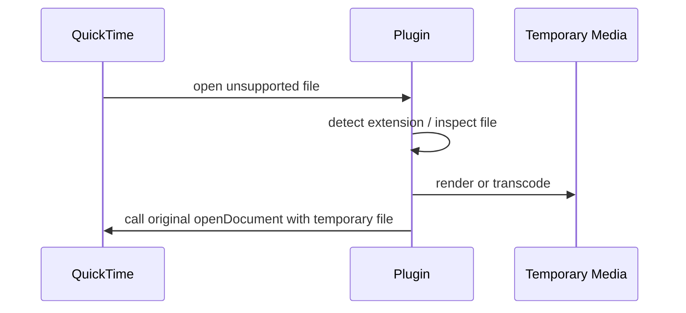

# Plugin Development

QuickTime Player Plus のプラグインは Objective-C の bundle です。拡張子は
`.qtplugin` にしていますが、中身は通常の macOS bundle と同じです。

## 最小構成

```text
MyPlugin.qtplugin/
└── Contents/
    ├── Info.plist
    └── MacOS/
        └── MyPlugin
```

`Info.plist`:

```xml
<?xml version="1.0" encoding="UTF-8"?>
<!DOCTYPE plist PUBLIC "-//Apple//DTD PLIST 1.0//EN" "http://www.apple.com/DTDs/PropertyList-1.0.dtd">
<plist version="1.0">
<dict>
    <key>CFBundleExecutable</key>
    <string>MyPlugin</string>
    <key>CFBundleIdentifier</key>
    <string>local.quicktimeplayerplus.myplugin</string>
    <key>CFBundleName</key>
    <string>My Plugin</string>
    <key>CFBundlePackageType</key>
    <string>BNDL</string>
    <key>CFBundleShortVersionString</key>
    <string>0.1.0</string>
    <key>CFBundleVersion</key>
    <string>1</string>
    <key>QTPPluginDescription</key>
    <string>Describe what this plugin opens or changes.</string>
    <key>QTPPluginSupportedExtensions</key>
    <array>
        <string>example</string>
    </array>
</dict>
</plist>
```

`MyPlugin.m`:

```objc
#import <Foundation/Foundation.h>
#import "QTPPlugin.h"

void QTPPluginMain(void)
{
    QTPLog(@"MyPlugin loaded");
}
```

`QTPPluginMain` がエントリポイントです。ローダーは bundle をロードした後、この symbol を探して
一度だけ呼びます。

## よくある実装パターン

QuickTime Player Plus のプラグインは、QuickTime の private decoder を直接増やすより、
次のような橋渡しをする方が安定します。



実装済みプラグインもこの形です。

- `QTPMIDIPlugin`: `.mid/.midi` を `.caf` にレンダリング
- `QTPTranscodePlugin`: Ogg / WebM / Matroska / WMV などを `.mp4` / `.m4a` に変換

## NSDocumentController の hook

QuickTime の書類 open は `NSDocumentController` / `MGDocumentController` を通ります。
既存プラグインは `openDocumentWithContentsOfURL:display:completionHandler:` と
`openDocumentWithContentsOfURL:display:error:` を swizzle しています。

注意点:

- constructor 直後に `sharedDocumentController` を触らない
  - QuickTime の nib が作る `MGDocumentController` より先に素の `NSDocumentController` が生成され、起動が壊れます
- `NSApplicationDidFinishLaunchingNotification` 後に実インスタンスの class へ追加 hook する
- 対象外の拡張子は必ず元実装へ戻す
- 変換後の一時ファイルを開く時に自分自身の拡張子判定へ再突入しないようにする

## キャッシュ

一時ファイルは `$TMPDIR/QuickTimePlayerPlus/<PluginName>` 配下に置くのが基本です。
起動時に前回分を削除してください。

```objc
NSURL *cacheURL = [[NSURL fileURLWithPath:NSTemporaryDirectory() isDirectory:YES]
    URLByAppendingPathComponent:@"QuickTimePlayerPlus/MyPlugin" isDirectory:YES];
```

ユーザーが管理画面の **Clear Render Caches** を押した場合は、
`$TMPDIR/QuickTimePlayerPlus` 全体が削除されます。

## 設定

軽い設定は `NSUserDefaults` を使います。例:

```objc
NSString *ffmpegPath = [NSUserDefaults.standardUserDefaults stringForKey:@"QTPFFmpegPath"];
```

管理画面で扱う設定を増やす場合は、ローダー側の `QTPPluginManagerController` に UI を足します。
プラグイン固有の重い設定が必要になったら、bundle identifier ごとの key prefix を使ってください。

```text
local.quicktimeplayerplus.myplugin.SomeSetting
```

## ビルド例

```make
PLUGIN_BUNDLE := build/PlugIns/MyPlugin.qtplugin
PLUGIN_EXECUTABLE := $(PLUGIN_BUNDLE)/Contents/MacOS/MyPlugin

$(PLUGIN_EXECUTABLE): plugins/MyPlugin/MyPlugin.m plugins/MyPlugin/Info.plist include/QTPPlugin.h
	mkdir -p $(PLUGIN_BUNDLE)/Contents/MacOS
	cp plugins/MyPlugin/Info.plist $(PLUGIN_BUNDLE)/Contents/Info.plist
	clang -arch arm64e -fobjc-arc -fmodules -Iinclude \
	  -bundle plugins/MyPlugin/MyPlugin.m -o $@ \
	  -framework Foundation -framework AppKit
	codesign --force --sign - $(PLUGIN_BUNDLE)
```

QuickTime 本体が `arm64e` なので、プラグインも `arm64e` で作ります。

## 配布

単体配布なら `.qtplugin` bundle を zip します。ユーザーは管理画面の **Add Plugin...** から
追加できます。

プリインストールにする場合は:

1. `plugins/<PluginName>/` に source と `Info.plist` を置く
2. `Makefile` に bundle target を追加
3. `script/build_application_bundle.sh` / `script/package_release.sh` が拾う
4. README の「入っているもの」に追加

## 次に作る候補

- **Game / Console Audio Plugin**: `.vgm`, `.vgz`, `.nsf`, `.spc`, `.psf`
- **Animated Image Plugin**: `.webp`, `.avif`, `.apng`
- **Image Sequence Plugin**: 連番画像フォルダや `frame_%04d.png`

どれも「入力を一時 `.caf` / `.mp4` に変換して QuickTime に戻す」形が扱いやすいです。
