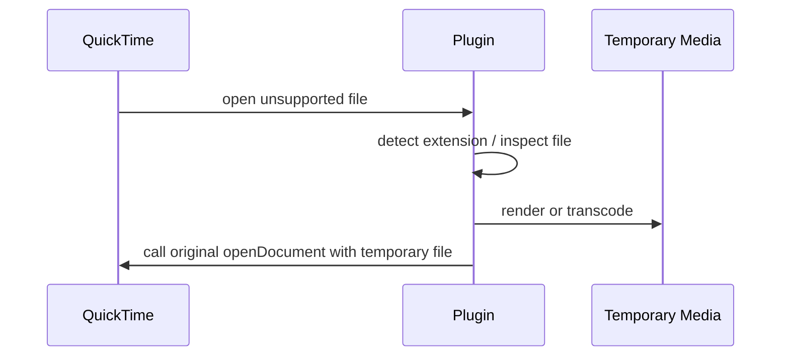

# Plugin Development

QuickTime Player Plus のプラグインは、Objective-C で実装する bundle です。
拡張子は `.qtplugin` ですが、内部構造は通常の macOS bundle と同じです。

## 最小構成

```text
MyPlugin.qtplugin/
└── Contents/
    ├── Info.plist
    └── MacOS/
        └── MyPlugin
```

`Info.plist`:

```xml
<?xml version="1.0" encoding="UTF-8"?>
<!DOCTYPE plist PUBLIC "-//Apple//DTD PLIST 1.0//EN" "http://www.apple.com/DTDs/PropertyList-1.0.dtd">
<plist version="1.0">
<dict>
    <key>CFBundleExecutable</key>
    <string>MyPlugin</string>
    <key>CFBundleIdentifier</key>
    <string>local.quicktimeplayerplus.myplugin</string>
    <key>CFBundleName</key>
    <string>My Plugin</string>
    <key>CFBundlePackageType</key>
    <string>BNDL</string>
    <key>CFBundleShortVersionString</key>
    <string>0.1.0</string>
    <key>CFBundleVersion</key>
    <string>1</string>
    <key>QTPPluginDescription</key>
    <string>Describe what this plugin opens or changes.</string>
    <key>QTPPluginSupportedExtensions</key>
    <array>
        <string>example</string>
    </array>
</dict>
</plist>
```

`MyPlugin.m`:

```objc
#import <Foundation/Foundation.h>
#import "QTPPlugin.h"

void QTPPluginMain(void)
{
    QTPLog(@"MyPlugin loaded");
}
```

`QTPPluginMain` がエントリポイントです。
ローダーは bundle を読み込んだ後、この symbol を探して一度だけ呼び出します。

## 実装パターン

QuickTime Player の private decoder を直接追加するより、未対応形式を一時メディアへ変換して元の open 処理へ戻す構成を基本とします。


```mermaid
sequenceDiagram
  participant Q as QuickTime
  participant P as Plugin
  participant T as Temporary Media
  Q->>P: open unsupported file
  P->>P: detect extension / inspect file
  P->>T: render or transcode
  P->>Q: call original openDocument with temporary file
```

既存のプラグインも同じ構成です。

- `QTPMIDIPlugin`：`.mid/.midi` を `.caf` にレンダリングします。
- `QTPTranscodePlugin`：Ogg / WebM / Matroska / WMV などを `.mp4` / `.m4a` に変換します。
- `QTPAnimatedImagePlugin`：GIF / WebP / AVIF / APNG を `.mp4` に変換します。
- `QTPGameAudioPlugin`：VGM / NSF / SPC / PSF などを `.m4a` に変換します。
- `QTPImageSequencePlugin`：連番画像を `.mp4` に変換します。

## NSDocumentController の hook

QuickTime の書類 open は `NSDocumentController` / `MGDocumentController` を通ります。
既存プラグインは `openDocumentWithContentsOfURL:display:completionHandler:` と `openDocumentWithContentsOfURL:display:error:` を swizzle しています。

実装時は次の点に注意してください。

- constructor の直後に `sharedDocumentController` へアクセスしないでください。
  QuickTime の nib が作る `MGDocumentController` より先に通常の `NSDocumentController` が生成され、起動処理を壊す場合があります。
- `NSApplicationDidFinishLaunchingNotification` の後で、実インスタンスの class へ追加 hook を行います。
- 対象外の拡張子は必ず元の実装へ渡します。
- 変換後の一時ファイルを開く際に、自分自身の拡張子判定へ再入しないようにします。

## キャッシュ

一時ファイルは、原則として `$TMPDIR/QuickTimePlayerPlus/<PluginName>` 配下へ保存します。
起動時に前回分を削除してください。

```objc
NSURL *cacheURL = [[NSURL fileURLWithPath:NSTemporaryDirectory() isDirectory:YES]
    URLByAppendingPathComponent:@"QuickTimePlayerPlus/MyPlugin" isDirectory:YES];
```

管理画面で **Clear Render Caches** を実行すると、`$TMPDIR/QuickTimePlayerPlus` 全体を削除します。

## 設定

軽量な設定には `NSUserDefaults` を使用します。

```objc
NSString *ffmpegPath = [NSUserDefaults.standardUserDefaults stringForKey:@"QTPFFmpegPath"];
```

管理画面で扱う設定を追加する場合は、ローダー側の `QTPPluginManagerController` に UI を追加します。
プラグイン固有の設定が多い場合は、bundle identifier を使った key prefix を付けてください。

```text
local.quicktimeplayerplus.myplugin.SomeSetting
```

## ビルド例

```make
PLUGIN_BUNDLE := build/PlugIns/MyPlugin.qtplugin
PLUGIN_EXECUTABLE := $(PLUGIN_BUNDLE)/Contents/MacOS/MyPlugin

$(PLUGIN_EXECUTABLE): plugins/MyPlugin/MyPlugin.m plugins/MyPlugin/Info.plist include/QTPPlugin.h
	mkdir -p $(PLUGIN_BUNDLE)/Contents/MacOS
	cp plugins/MyPlugin/Info.plist $(PLUGIN_BUNDLE)/Contents/Info.plist
	clang -arch arm64e -fobjc-arc -fmodules -Iinclude \
	  -bundle plugins/MyPlugin/MyPlugin.m -o $@ \
	  -framework Foundation -framework AppKit
	codesign --force --sign - $(PLUGIN_BUNDLE)
```

QuickTime 本体が `arm64e` で動作するため、プラグインも `arm64e` でビルドします。

## 配布

単体で配布する場合は、`.qtplugin` bundle を ZIP にします。
ユーザーは管理画面の **Add Plugin...** から追加できます。

プリインストールプラグインとして追加する場合は、次の作業を行います。

1. `plugins/<PluginName>/` に source と `Info.plist` を配置します。
2. `Makefile` に bundle target を追加します。
3. `script/build_application_bundle.sh` / `script/package_release.sh` の対象に追加します。
4. README の「同梱コンポーネント」に追加します。

## 追加候補

- **Game / Console Audio Plugin**：`.vgm`, `.vgz`, `.nsf`, `.spc`, `.psf`
- **Animated Image Plugin**：`.webp`, `.avif`, `.apng`
- **Image Sequence Plugin**：連番画像フォルダや `frame_%04d.png`

いずれも、入力を一時 `.caf` または `.mp4` へ変換し、QuickTime Player の通常の open 処理へ戻す構成を利用できます。
